# Compilación e Instalación Manual del Kernel 6.1 en Oracle Linux 8 (VirtualBox)

## Introducción

Este documento describe el proceso para compilar e instalar manualmente el kernel 6.1 en Oracle Linux 8 ejecutándose en una máquina virtual VirtualBox.

---

## 1. Verificar la versión actual del kernel

Antes de iniciar cualquier actualización, es fundamental saber qué versión del kernel está corriendo actualmente.

```bash
uname -r
```

Versión del kernel actual (`5.15.0-312.187.5.3.el8uek.x86_64`)

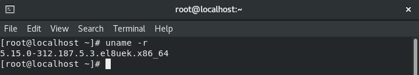
*Versión actual del kernel en ejecución*

---

## 2. Verificar conectividad y repositorios

Se asegura de tener acceso a internet y que los repositorios estén correctamente configurados.

```bash
ping -c 4 www.google.com
sudo dnf repolist
```

**Captura de pantalla:**

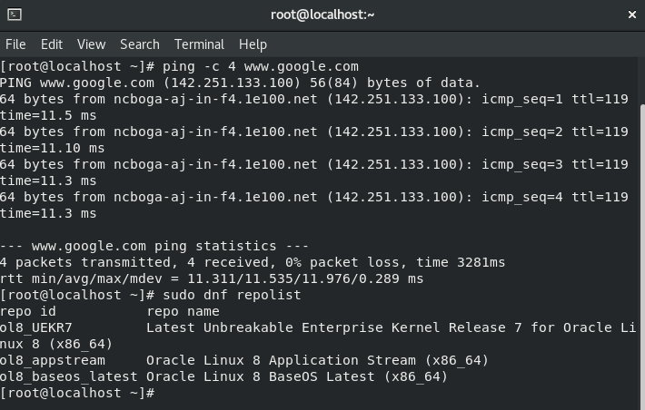
*Repositorios DNF configurados y habilitados*

---

## 3. Buscar actualizaciones disponibles del kernel

```bash
sudo dnf check-update kernel
```

**Captura de pantalla:**

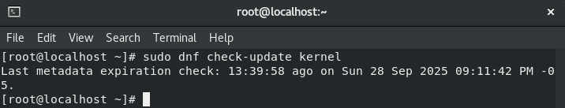
*Verificación de actualizaciones disponibles del kernel*

---

## 4. Preparar el entorno de compilación

```bash
sudo dnf update -y
sudo dnf groupinstall "Development Tools" -y
sudo dnf install ncurses-devel bison flex elfutils-libelf-devel openssl-devel gcc make wget bc perl -y
```

**Capturas de pantalla del proceso:**

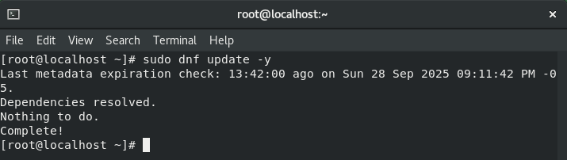
*Actualización de todos los paquetes del sistema*

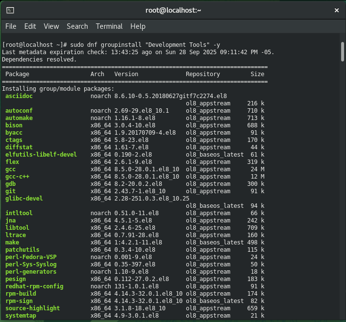
*Instalación de Development Tools - Parte 1*

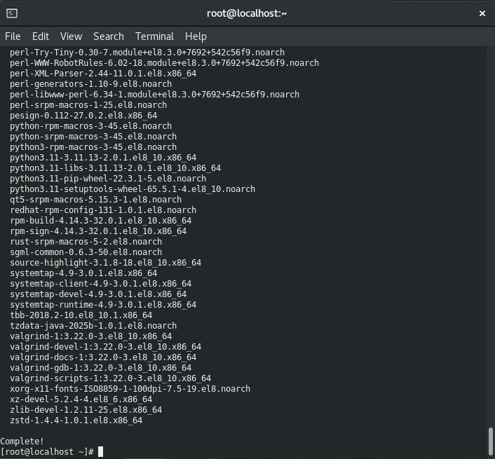
*Instalación de Development Tools - Parte 2*

---

## 5. Descargar el código fuente del kernel 6.1

```bash
wget https://cdn.kernel.org/pub/linux/kernel/v6.x/linux-6.1.tar.xz
tar -xvf linux-6.1.tar.xz
cd linux-6.1
```

**Capturas de pantalla del proceso:**

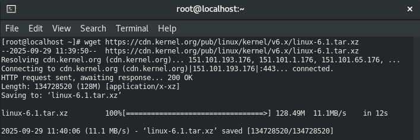
*Descarga del código fuente del kernel 6.1 desde kernel.org*

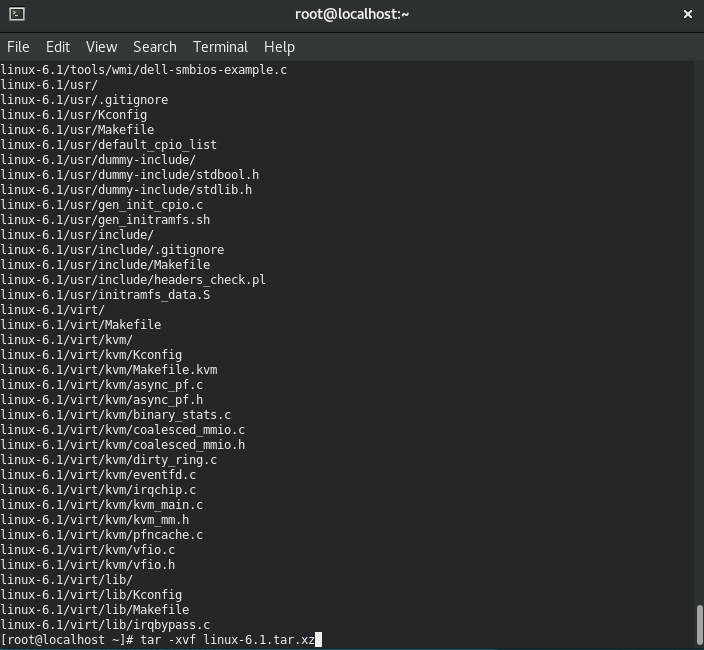
*Extracción del archivo comprimido del kernel*

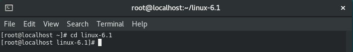
*Acceso al directorio del código fuente*

---

## 6. Configurar el kernel

1. **Copia la configuración actual como base:**
   ```bash
   cp /boot/config-$(uname -r) .config
   ```
   Permitiendo así partir de una configuración probada y compatible con tu sistema.

2. **Abre el menú de configuración:**
   ```bash
   make menuconfig
   ```
   Se abrirá una interfaz en la terminal donde se personalizaron las opciones del kernel.

3. **Revisar y ajustar las opciones recomendadas:**
   - Drivers de hardware: Se activan los controladores necesarios para tu entorno.
   - Sistemas de archivos: Se activa ext4 y otros sistemas que uses.
   - Virtualización: Se activa soporte para KVM si lo necesitas.
   - Opciones de seguridad: Se revisa SELinux y otras según tu entorno.

4. **Desactivar la verificación y firma de módulos:**
   - Se Navega a **Enable loadable module support**.
   - Se Desactivaron las opciones:
     - `Require modules to be validly signed`
     - `Automatically sign all modules`
   - La opción **Module signature verification** aparece como activada y no se puede desactivar (`[*]` y `---`), es porque otra opción la fuerza.
   - Se va a **Security options** y desactiva cualquier opción relacionada con "lockdown" o restricciones de seguridad que puedan forzar la firma de módulos.

5. **Soluciona problemas de certificados:**
   - Si la compilación falla por falta de `certs/ol_signing_keys.pem`, se edita el archivo `.config`:
     - Busca la línea:
       ```
       CONFIG_SYSTEM_TRUSTED_KEYS="certs/ol_signing_keys.pem"
       ```
       y cámbiala por:
       ```
       CONFIG_SYSTEM_TRUSTED_KEYS=""
       ```
     - Busca la línea:
       ```
       CONFIG_SYSTEM_REVOCATION_KEYS="..."
       ```
       y cámbiala por:
       ```
       CONFIG_SYSTEM_REVOCATION_KEYS=""
       ```
   - Se guardan los cambios y vuelve a intentar la compilación.

6. **Guardar la configuración:**
   - En el menú, se selecciona `<Save>` y se confirma el nombre del archivo (`.config`).
   - Se sale del menú con `<Exit>`.

**Capturas de pantalla del menú de configuración:**

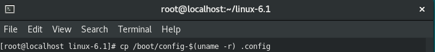
*Pantalla principal del menú de configuración (menuconfig)*

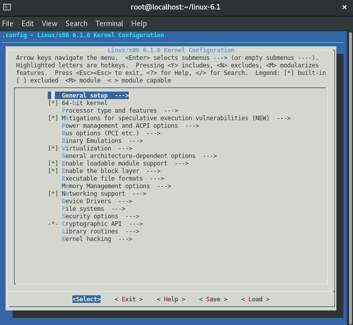
*Navegación por opciones específicas de configuración*

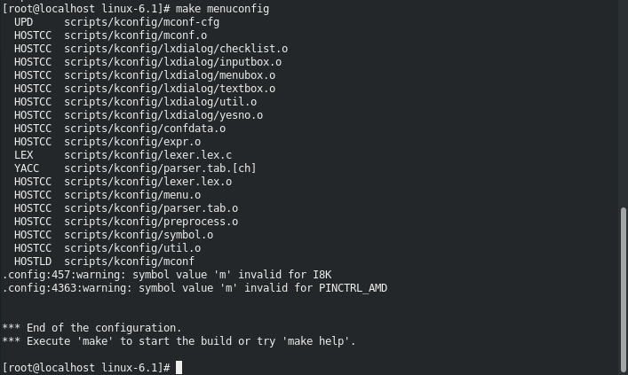
*Configuración de módulos y drivers del kernel*

### Agregados de configuración en menuconfig

1. **Drivers de hardware (VirtualBox)**<br>
- Se Usan las flechas para navegar.<br>
- Se Va a Device Drivers → Network device support → Ethernet driver support → Intel(R) PRO/1000 Gigabit Ethernet support.<br>
**Presionar M para activarlo como módulo (<M>).**<br>
- Se Va a Device Drivers → USB support.<br>
**Activar USB xHCI HCD (USB 3.0) support con Y o M.**<br>
- Se Va a Device Drivers → Block devices.<br>
**Activar Virtio block driver con Y o M.**<br>

1. **Sistemas de archivos**<br>
- Se va a File systems.<br>
**Activar ext4 con Y.**
**Activar otros sistemas de archivos que uses (por ejemplo, xfs, btrfs, NTFS) con Y o M según tu necesidad.**

1. **Virtualización**<br>
- Se va a Virtualization.<br>
**Activar KVM for Intel processors support con Y (si tu procesador es Intel).**<br>
**Activar KVM for AMD processors support con Y (si tu procesador es AMD).**<br>

1. **Seguridad**<br>
- Se va a Security options.<br>
**Activar Enable SELinux support con Y si tu sistema lo requiere.**<br>
**Activar otras opciones de seguridad según tus necesidades.**<br>

1. **Opciones generales**<br>
- Ve a General setup.<br>
**Verificar que 64-bit kernel esté activado ([*]).**<br>
**Revisar otras opciones generales y déjalas por defecto si no estás seguro.**<br>

1. **Guardar la configuración**<br>
- Presionar Tab para seleccionar <Save>.<br>
- Presionar Enter y confirmar el nombre del archivo (.config).

1. **Salir del menú**<br>
- Seleccionar <Exit> o presionar Esc Esc hasta salir completamente.

---

## 7. Compilar e instalar el kernel

### 7.1. Comandos de compilación

```bash
make -j$(nproc)
```

Este comando compila el kernel utilizando todos los núcleos del procesador disponibles, lo que acelera significativamente el proceso.

### 7.2. Instalación de módulos y kernel

Una vez completada la compilación **sin errores**, ejecuta:

```bash
sudo make modules_install
sudo make install
```

**Importante:** Ejecutar estos comandos **en ese orden**. El comando `make install`:
- Copiar `vmlinuz-6.1.0` a `/boot/`
- Copiar `System.map-6.1.0` a `/boot/`
- Generar `initramfs-6.1.0.img` en `/boot/`
- Actualizar GRUB automáticamente

### 7.3. Errores comunes y soluciones

**Error 1: Missing file: arch/x86/boot/bzImage**

Si al ejecutar `sudo make install` aparece:
```
*** Missing file: arch/x86/boot/bzImage
*** You need to run "make" before "make install".
make: *** [arch/x86/Makefile:286: install] Error 1
```

**Causa:** No se ejecutó el comando `make` o la compilación falló antes de completarse.

**Solución:**
1. Verificar que no haya errores pendientes en la compilación.
2. Ejecutar de nuevo:
   ```bash
   make -j$(nproc)
   ```
3. Una vez completado sin errores, ejecutar:
   ```bash
   sudo make modules_install
   sudo make install
   ```

---

**Error 2: Failed to generate BTF for vmlinux (pahole no disponible)**

Si durante la compilación aparece:
```
BTF: .tmp_vmlinux.btf: pahole (pahole) is not available
Failed to generate BTF for vmlinux
Try to disable CONFIG_DEBUG_INFO_BTF
make[1]: *** [scripts/Makefile.vmlinux:34: vmlinux] Error 1
make: *** [Makefile:1236: vmlinux] Error 2
```
Esto ocurre porque la herramienta `pahole` no está disponible en los repositorios de Oracle Linux 8.

**Solución:**
1. Abrir el archivo `.config` en el directorio del kernel:
   ```bash
   nano .config
   ```
2. Buscar la línea `CONFIG_DEBUG_INFO_BTF=y` y cambiarla por:
   ```
   CONFIG_DEBUG_INFO_BTF=n
   ```
3. Guardar los cambios (Ctrl+O, Enter) y cerrar el editor (Ctrl+X).
4. Limpiar los archivos generados previamente:
   ```bash
   make clean
   ```
5. Volver a compilar:
   ```bash
   make -j$(nproc)
   ```

BTF (BPF Type Format) requiere la herramienta `pahole` que no está disponible en Oracle Linux 8. Desactivar esta opción permite compilar sin problemas.

---

### 7.4. Documentación del proceso

Documentar todos los pasos de la compilación e instalación:

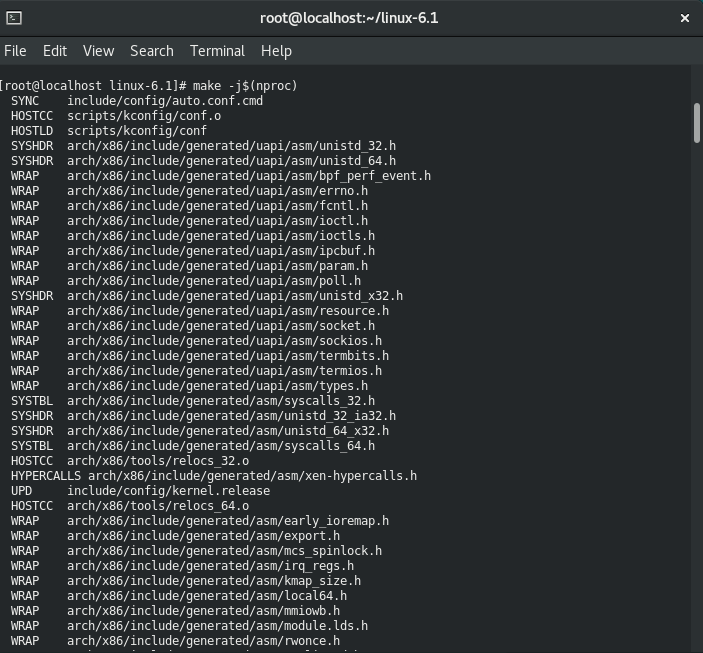
*Proceso de compilación del kernel con make*

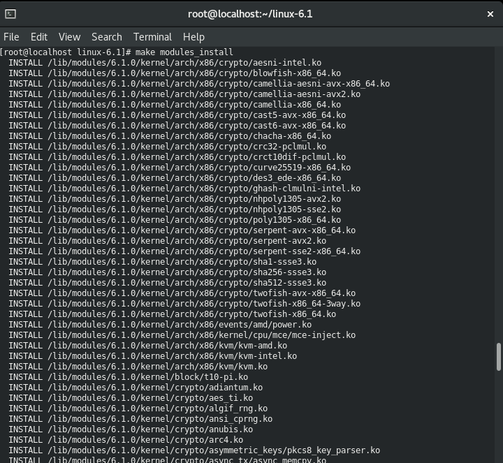
*Instalación de módulos del kernel*


*Instalación final del kernel en /boot*

---

## 8. Actualizar GRUB y reiniciar

### 8.1. Verificar la instalación del kernel antes del reinicio

**Antes de reiniciar**, es crucial verificar que el kernel se instaló correctamente en `/boot/`:

```bash
ls -lh /boot/vmlinuz-6.1*
ls -lh /boot/initramfs-6.1*
ls -lh /boot/System.map-6.1*
```

**Debes ver:** Tres archivos para el kernel 6.1 (vmlinuz, initramfs y System.map). Si no aparecen, se ejecuta:

```bash
cd /root/linux-6.1
sudo make modules_install
sudo make install
```

### 8.2. Actualizar GRUB

Una vez confirmado que los archivos del kernel están en `/boot/`, se actualiza GRUB:

```bash
sudo grub2-mkconfig -o /boot/grub2/grub.cfg
```

**Salida esperada:** GRUB detectará automáticamente el nuevo kernel 6.1 y lo añadirá al menú de arranque.

### 8.3. Reiniciar el sistema

```bash
sudo reboot
```

**Capturas de pantalla:**

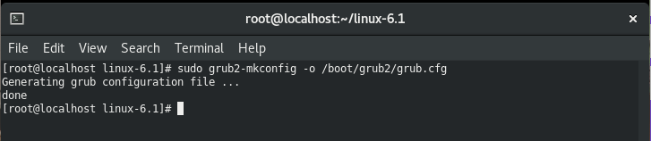
*Actualización del gestor de arranque GRUB*

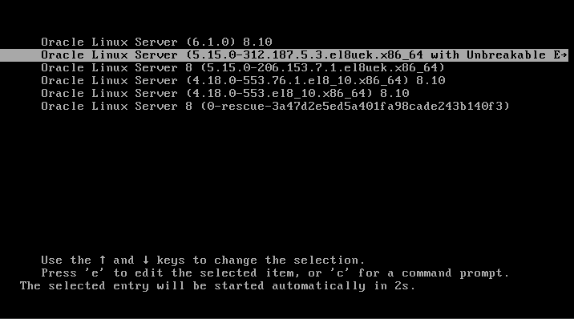
*Reinicio del sistema para cargar kernel 6.1*

---

## 9. Verificar el kernel activo tras el reinicio

```bash
uname -r
```

**Salida esperada:** `6.1.0` o versión similar

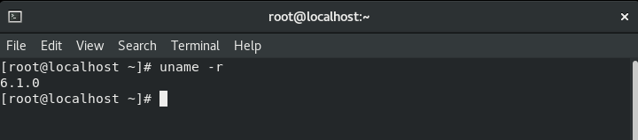
*Verificación del kernel 6.1 activo después del reinicio*

---

## Trabajo Investigativo

- Linux (por ejemplo: Ubuntu, Debian, Oracle Linux, Red Hat): Monolítico modular
   - Kernel monolítico (todo el subsistema central en ring 0) pero con módulos cargables dinámicamente para controladores y extensiones.

- Microsoft Windows (NT family): Híbrido (o microkernel-like/hybrid)
   - Kernel monolítico en prestaciones con arquitectura híbrida (NT kernel) que mezcla servicios en espacio de usuario y kernel, con subsistemas modulares.

- macOS (XNU): Híbrido (Mach microkernel + BSD monolítico components)
   - XNU combina el microkernel Mach para mensajería y manejo de hilos con componentes BSD y controladores que aportan funcionalidades típicas de kernels monolíticos.

- FreeBSD / NetBSD / OpenBSD: Monolítico modular (BSD)
   - Kernels estilo BSD con diseño monolítico tradicional pero con soporte fuerte para módulos y subsistemas bien separados.

- DragonFly BSD: Derivado de BSD / monolítico con mejoras de microkernel-concepts
   - Basado en BSD pero con reingeniería para concurrencia y subsistemas (ej. sistema de mensajería internamente); generalmente tratado como monolítico con modularidad.

- Minix (3.x): Microkernel
   - Diseñado explícitamente como microkernel donde servidores en espacio de usuario proporcionan la mayoría de servicios (archivos, drivers, red).

- QNX: Microkernel (mensaje-passing)
   - Microkernel comercial de tiempo real basado en paso de mensajes, con controladores y servicios en espacio de usuario.

- Haiku (BeOS-inspired): Monolítico modular / híbrido ligero
   - Kernel inspirado en BeOS (NewOS) con diseño monolítico pero modular y con muchas ideas de microkernel en su arquitectura interna.

- AIX (IBM) y Solaris (Oracle/Sun): Monolítico con módulos (monolítico modular)
   - Tradicionalmente kernels monolíticos de grado empresarial con soporte extenso de módulos y servicios dentro del kernel para rendimiento y gestión de recursos.

- Embedded RTOS (ej.: Zephyr, FreeRTOS): Microkernel / Small-kernel (varía)
   - Muchos RTOS usan diseños minimalistas (microkernel-like o monolítico reducido) orientados a latencia y tamaño; la clasificación depende de la implementación específica.
```